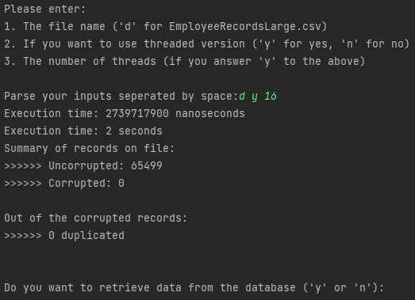
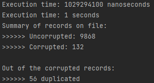
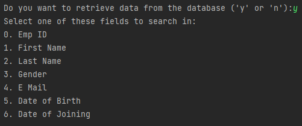
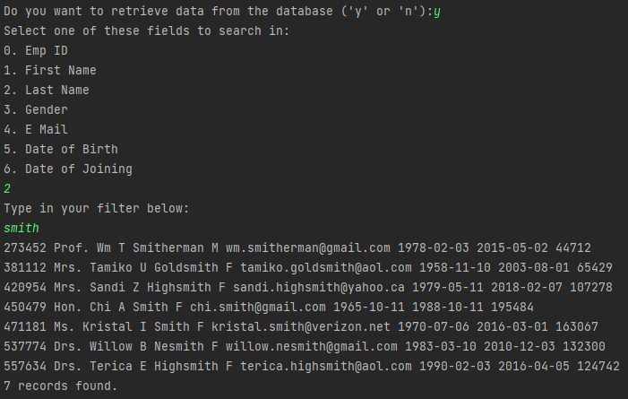
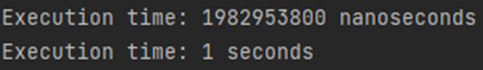

# The_300_Data_Migration_Project

## Table of content

- [Model][1]
- [Controller][2]
- [Logger][3]

[1]: (https://github.com/JamesKempadoo/The_300_Data_Migration_Project/tree/dev/src/main/java/com/sparta/the300/model) "Model"
[2]: (https://github.com/JamesKempadoo/The_300_Data_Migration_Project/tree/dev/src/main/java/com/sparta/the300/controller) "Controller"
[3]: (https://github.com/JamesKempadoo/The_300_Data_Migration_Project/tree/dev/src/main/java/com/sparta/the300/loggers) "Loggers"

### Application purpose
The project allows the user to firstly read the data from a CSV file by implementing the CSV reader
and the read data file method.Using the split method by "," the separation of the fields is done. 
The data is handled using the IF statement to create three different lists that contain the correct
data, corrupted data and duplicate data. 

### Usage
>1. Once running the Main file you will be given a prompt and will have to input a phrase for your options.
>   2. The format being "d y 16" or "d n".
>      3. "d" resembles the given EmployeeRecordsLarge.csv file, but this can be replaced with a different csv file by
>       replacing "d" with its path i.e. "example.csv y 16"
>      4. "y" will turn on threads and replacing it with "n" will run it without threads
>      5. If chosen "y" for threads, then it can be given the number of threads for example "16". If you chose "n"
>      for threads then you will not need ot put anything\
>    
>2. It will output the execution time of the programming in nanoseconds and seconds.
>3. Underneath this output it will also show how many uncorrupted and corrupted records there were within the csv and
> whether there were duplicated records\
    
>4. Once completed it will ask if you want to retrieve data from database with the options of "y" or "n".
>5. Pressing "n" will close the program
>6. When inputted "y" it will give you an option for what element you want to search the database table.
    
>7. Once entering one of the option with a value from 0-6 you be asked what you want to search for depending on the
> element your choice for example:
>8. As can be seen above, when asking for a record it will not select a specific name dependent on exactly what
> you typed, but will receive everything that has you input within it
### Installation

- Download Zip file from git directory.
- Open project within IDE.
- Change your login properties (username,password) from the resources directory.
- Run the application from the Main Class.
- Create an "employeesdb"  database to migrate the data from the CSV file you are using.

### Fields of Data

| EmployeeID | Name prefix | FirstName | MiddleName | LastName | Gender | E-mail | Date of Birth | Date of Joinning | Salary |
|:----------:|:-----------:|:---------:|:----------:|:--------:|:--------:|:------:|:-------------:|:----------------:|:------:|

### Time Efficiency
This section purpose is to compare the time efficiency of the application using different
number of threads. The thread usage is important as the second part of the project has
to do with the data transfer of a large file.

| Number of threads | Time (s) |
|:-----------------:|:--------:|
|         0         |   8.01   | 
|         1         |   7.47   |
|         2         |   4.74   |
|         4         |   3.08   |
|         8         |   2.34   |
|        16         |   1.98   |
|        20         |   2.09   |
|        32         |   2.45   |
>Fastest Time what our group could accomplish with this code\

